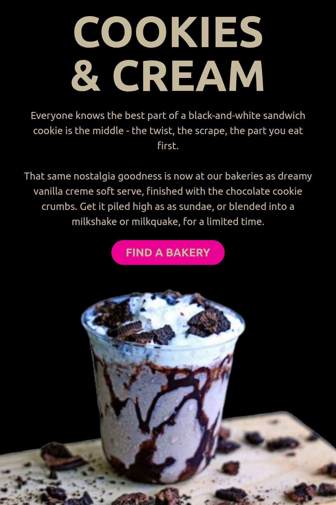
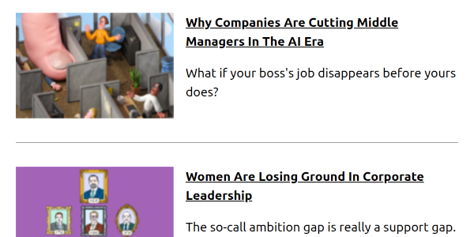
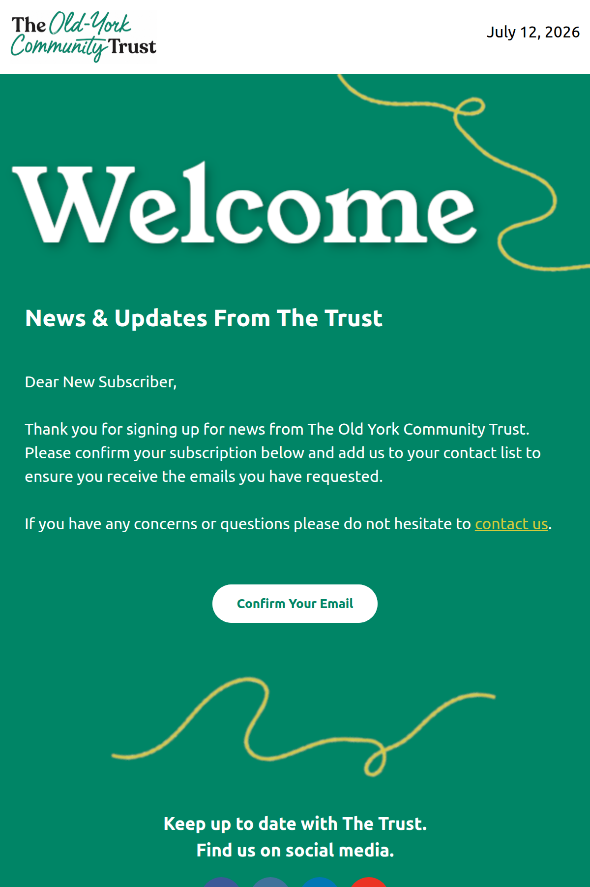
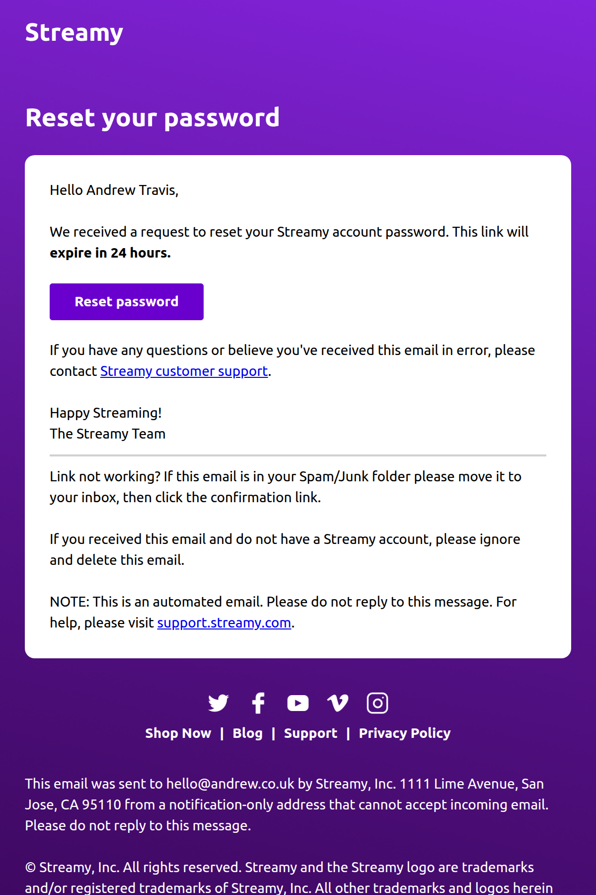
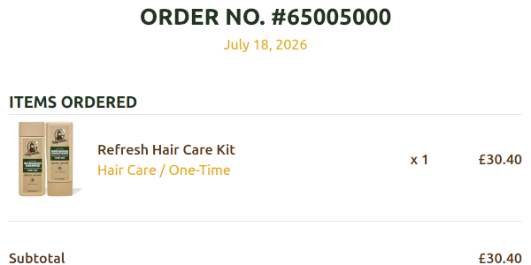

# Responsive Email Templates

A collection of responsive email templates built using MJML.

## Technologies

- MJML
- Handlebars
- HTML Email
- Node.js
- Git

## Workflow

MJML templates are compiled into HTML and personalised using Handlebars before delivery.

(MJML → HTML → Handlebars Personalisation → Email Delivery)

## Features

- Responsive layouts
- Handlebars personalization
- Transactional and marketing emails
- Gmail desktop tested
- Gmail Android tested
- Dark mode optimised
- Accessible alt text

## Email Template Overview

| Email Type              | MJML | Handlebars | Tested On                  |
|-------------------------|:----:|:----------:|----------------------------|
| Promotional             |  ✅  |     ✅     | Gmail Chrome + Android App    |
| Newsletter              |  ✅  |     ✅     | Gmail Chrome + Android App    |
| Welcome / Verification  |  ✅  |     ✅     | Gmail Chrome + Android App    |
| Password Reset          |  ✅  |     ✅     | Gmail Chrome + Android App    |
| Order Confirmation      |  ✅  |     ✅     | Gmail Chrome + Android App    |
| Booking Confirmation    |  ✅  |     ✅     | Gmail Chrome + Android App    |

## Testing
> Templates were tested using real email clients (Gmail in Chrome and Gmail Android App) rather than commercial rendering services.

Each template was tested for:

- Gmail Desktop (Chrome)
- Gmail Android App
- Responsive behaviour
- Dark mode compatibility
- Accessibility considerations
- Descriptive image alt text

## Promotional Email

_Click preview to view full desktop render_

Responsive promotional email featuring a large hero product image, personalised content, and a clear call-to-action. Built with MJML and Handlebars.

<a href="https://raw.githubusercontent.com/AndrewAttemptsCode/email-templates/refs/heads/main/src/assets/images/screenshots/promotional_desktop.png">🖥️ Desktop full screenshot</a> 
<a href="https://raw.githubusercontent.com/AndrewAttemptsCode/email-templates/refs/heads/main/src/assets/images/screenshots/promotional_mobile.png">📱 Mobile full screenshot</a> 
<a href="https://github.com/AndrewAttemptsCode/email-templates/blob/main/src/templates/promotional.mjml">📄 MJML Source</a> 
<a href="https://github.com/AndrewAttemptsCode/email-templates/blob/main/dist/promotional.html">🌐 HTML Output</a>

## Newsletter Email

_Click preview to view full desktop render_

Responsive newsletter email featuring a hero article, additional article previews, newsletter sign-up and subscription call-to-actions, and mobile app download links. Built with MJML and Handlebars.

<a href="https://raw.githubusercontent.com/AndrewAttemptsCode/email-templates/refs/heads/main/src/assets/images/screenshots/newsletter_desktop.png">🖥️ Desktop full screenshot</a> 
<a href="https://raw.githubusercontent.com/AndrewAttemptsCode/email-templates/refs/heads/main/src/assets/images/screenshots/newsletter_mobile.png">📱 Mobile full screenshot</a> 
<a href="https://github.com/AndrewAttemptsCode/email-templates/blob/main/src/templates/newsletter.mjml">📄 MJML Source</a> 
<a href="https://github.com/AndrewAttemptsCode/email-templates/blob/main/dist/handlebars-newsletter.html">🌐 HTML Output</a>

## Welcome/Verification Email

_Click preview to view full desktop render_

Responsive welcome and email verification email featuring personalised content, a confirmation call-to-action, social media links, and account management links. Built with MJML and Handlebars.

<a href="https://raw.githubusercontent.com/AndrewAttemptsCode/email-templates/refs/heads/main/src/assets/images/screenshots/verification_desktop.png">🖥️ Desktop full screenshot</a> 
<a href="https://raw.githubusercontent.com/AndrewAttemptsCode/email-templates/refs/heads/main/src/assets/images/screenshots/verification_mobile.png">📱 Mobile full screenshot</a> 
<a href="https://github.com/AndrewAttemptsCode/email-templates/blob/main/src/templates/accountactivation.mjml">📄 MJML Source</a> 
<a href="https://github.com/AndrewAttemptsCode/email-templates/blob/main/dist/handlebars-accountactivation.html">🌐 HTML Output</a>

## Password Reset Email

_Click preview to view full desktop render_

Responsive password reset email featuring a secure reset call-to-action, account support, navigation links, and social media links. Built with MJML and Handlebars.

<a href="https://raw.githubusercontent.com/AndrewAttemptsCode/email-templates/refs/heads/main/src/assets/images/screenshots/forgotpassword_desktop.png">🖥️ Desktop full screenshot</a> 
<a href="https://raw.githubusercontent.com/AndrewAttemptsCode/email-templates/refs/heads/main/src/assets/images/screenshots/forgotpassword_mobile.png">📱 Mobile full screenshot</a> 
<a href="https://github.com/AndrewAttemptsCode/email-templates/blob/main/src/templates/forgotpassword.mjml">📄 MJML Source</a> 
<a href="https://github.com/AndrewAttemptsCode/email-templates/blob/main/dist/handlebars-forgotpassword.html">🌐 HTML Output</a>

## Order Confirmation Email

_Click preview to view full desktop render_

Responsive order confirmation email featuring order and tracking details, payment and delivery summaries, order status, product recommendations, messaging sign-up, customer support, navigation, and social media links. Built with MJML and Handlebars.

<a href="https://raw.githubusercontent.com/AndrewAttemptsCode/email-templates/refs/heads/main/src/assets/images/screenshots/orderconfirmation_desktop.png">🖥️ Desktop full screenshot</a> 
<a href="https://raw.githubusercontent.com/AndrewAttemptsCode/email-templates/refs/heads/main/src/assets/images/screenshots/orderconfirmation_mobile.png">📱 Mobile full screenshot</a> 
<a href="https://github.com/AndrewAttemptsCode/email-templates/blob/main/src/templates/orderconfirmation.mjml">📄 MJML Source</a> 
<a href="https://github.com/AndrewAttemptsCode/email-templates/blob/main/dist/handlebars-orderconfirmation.html">🌐 HTML Output</a>

