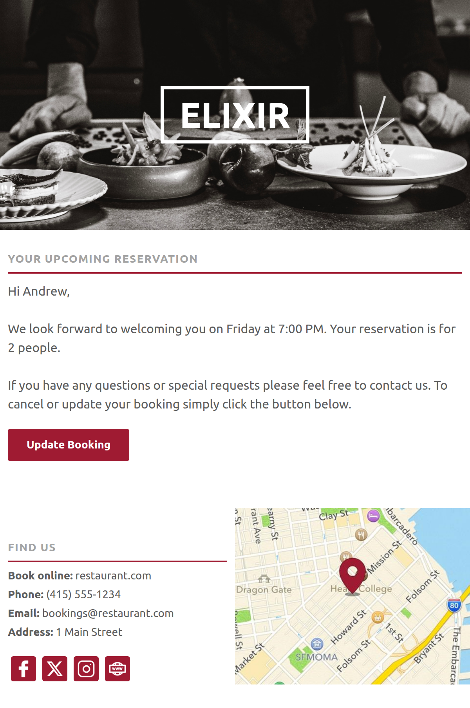

[← Back to Email Templates](../../README.md)

# Responsive Email Templates

A collection of responsive email templates built using MJML.

## Technologies

- MJML
- Handlebars
- HTML Email
- Node.js
- Git

## Workflow

MJML templates are compiled into HTML and personalised using Handlebars before delivery.

(MJML → HTML → Handlebars Personalisation → Email Delivery)

## Features

- Responsive layouts
- Handlebars personalization
- Transactional and marketing emails
- Gmail desktop tested
- Gmail Android tested
- Dark mode optimised
- Accessible alt text

## Testing
> Templates were tested using real email clients (Gmail in Chrome and Gmail Android App) rather than commercial rendering services.

Each template was tested for:

- Gmail Desktop (Chrome)
- Gmail Android App
- Responsive behaviour
- Dark mode compatibility
- Accessibility considerations
- Descriptive image alt text

## Promotional Email

_Click preview to view full desktop render_

Responsive promotional email featuring a large hero product image, personalised content, and a clear call-to-action. Built with MJML and Handlebars.

<a href="https://raw.githubusercontent.com/AndrewAttemptsCode/email-templates/refs/heads/main/src/assets/images/screenshots/promotional_desktop.png">🖥️ Desktop full screenshot</a> 
<a href="https://raw.githubusercontent.com/AndrewAttemptsCode/email-templates/refs/heads/main/src/assets/images/screenshots/promotional_mobile.png">📱 Mobile full screenshot</a> 
<a href="https://github.com/AndrewAttemptsCode/email-templates/blob/main/src/assorted/journeys/promotional/promotional.mjml">📄 MJML Source</a> 
<a href="https://github.com/AndrewAttemptsCode/email-templates/blob/main/dist/assorted/compiled/promotional.html">🌐 HTML Compiled Output</a> 
<a href="https://github.com/AndrewAttemptsCode/email-templates/blob/main/dist/assorted/personalised/handlebars-promotional.html">🌐 HTML Personalised Output</a>

## Newsletter Email

_Click preview to view full desktop render_

Responsive newsletter email featuring a hero article, additional article previews, newsletter sign-up and subscription call-to-actions, and mobile app download links. Built with MJML and Handlebars.

<a href="https://raw.githubusercontent.com/AndrewAttemptsCode/email-templates/refs/heads/main/src/assets/images/screenshots/newsletter_desktop.png">🖥️ Desktop full screenshot</a> 
<a href="https://raw.githubusercontent.com/AndrewAttemptsCode/email-templates/refs/heads/main/src/assets/images/screenshots/newsletter_mobile.png">📱 Mobile full screenshot</a> 
<a href="https://github.com/AndrewAttemptsCode/email-templates/blob/main/src/assorted/journeys/newsletter/newsletter.mjml">📄 MJML Source</a> 
<a href="https://github.com/AndrewAttemptsCode/email-templates/blob/main/dist/assorted/compiled/newsletter.html">🌐 HTML Compiled Output</a> 
<a href="https://github.com/AndrewAttemptsCode/email-templates/blob/main/dist/assorted/personalised/handlebars-newsletter.html">🌐 HTML Personalised Output</a>

## Welcome/Verification Email

_Click preview to view full desktop render_

Responsive welcome and email verification email featuring personalised content, a confirmation call-to-action, social media links, and account management links. Built with MJML and Handlebars.

<a href="https://raw.githubusercontent.com/AndrewAttemptsCode/email-templates/bb2cd499d368d19994ae816569cb14ed1d15a111/src/assets/images/screenshots/verification_desktop.png">🖥️ Desktop full screenshot</a> 
<a href="https://raw.githubusercontent.com/AndrewAttemptsCode/email-templates/bb2cd499d368d19994ae816569cb14ed1d15a111/src/assets/images/screenshots/verification_mobile.png">📱 Mobile full screenshot</a> 
<a href="https://github.com/AndrewAttemptsCode/email-templates/blob/main/src/assorted/journeys/welcome/accountactivation.mjml">📄 MJML Source</a> 
<a href="https://github.com/AndrewAttemptsCode/email-templates/blob/main/dist/assorted/compiled/accountactivation.html">🌐 HTML Compiled Output</a> 
<a href="https://github.com/AndrewAttemptsCode/email-templates/blob/main/dist/assorted/personalised/handlebars-accountactivation.html">🌐 HTML Personalised Output</a>

## Password Reset Email

_Click preview to view full desktop render_

Responsive password reset email featuring a secure reset call-to-action, account support, navigation links, and social media links. Built with MJML and Handlebars.

<a href="https://raw.githubusercontent.com/AndrewAttemptsCode/email-templates/refs/heads/main/src/assets/images/screenshots/forgotpassword_desktop.png">🖥️ Desktop full screenshot</a> 
<a href="https://raw.githubusercontent.com/AndrewAttemptsCode/email-templates/refs/heads/main/src/assets/images/screenshots/forgotpassword_mobile.png">📱 Mobile full screenshot</a> 
<a href="https://github.com/AndrewAttemptsCode/email-templates/blob/main/src/assorted/journeys/password-reset/forgotpassword.mjml">📄 MJML Source</a> 
<a href="https://github.com/AndrewAttemptsCode/email-templates/blob/main/dist/assorted/compiled/forgotpassword.html">🌐 HTML Compiled Output</a> 
<a href="https://github.com/AndrewAttemptsCode/email-templates/blob/main/dist/assorted/personalised/handlebars-forgotpassword.html">🌐 HTML Personalised Output</a>

## Order Confirmation Email

_Click preview to view full desktop render_

Responsive order confirmation email featuring order and tracking details, payment and delivery summaries, order status, product recommendations, messaging sign-up, customer support, navigation, and social media links. Built with MJML and Handlebars.

<a href="https://raw.githubusercontent.com/AndrewAttemptsCode/email-templates/44845121f545b597074a4e0d5d7b813e7dfe26d4/src/assets/images/screenshots/orderconfirmation_desktop.png">🖥️ Desktop full screenshot</a> 
<a href="https://raw.githubusercontent.com/AndrewAttemptsCode/email-templates/44845121f545b597074a4e0d5d7b813e7dfe26d4/src/assets/images/screenshots/orderconfirmation_mobile.png">📱 Mobile full screenshot</a> 
<a href="https://github.com/AndrewAttemptsCode/email-templates/blob/main/src/assorted/journeys/order-confirmation/orderconfirmation.mjml">📄 MJML Source</a> 
<a href="https://github.com/AndrewAttemptsCode/email-templates/blob/main/dist/assorted/compiled/orderconfirmation.html">🌐 HTML Compiled Output</a> 
<a href="https://github.com/AndrewAttemptsCode/email-templates/blob/main/dist/assorted/personalised/handlebars-orderconfirmation.html">🌐 HTML Personalised Output</a>

## Booking Confirmation Email

_Click preview to view full desktop render_

Responsive booking confirmation email featuring reservation details, guest count, date and time, a booking management call-to-action, venue map and address, contact information, and social media links. Built with MJML and Handlebars.

<a href="https://raw.githubusercontent.com/AndrewAttemptsCode/email-templates/ac0b0406a1286d1246207d19283a91fa7ba9214e/src/assets/images/screenshots/bookingconfirmation_desktop.png">🖥️ Desktop full screenshot</a> 
<a href="https://raw.githubusercontent.com/AndrewAttemptsCode/email-templates/ac0b0406a1286d1246207d19283a91fa7ba9214e/src/assets/images/screenshots/bookingconfirmation_mobile.png">📱 Mobile full screenshot</a> 
<a href="https://github.com/AndrewAttemptsCode/email-templates/blob/main/src/assorted/journeys/booking-confirmation/transactional.mjml">📄 MJML Source</a> 
<a href="https://github.com/AndrewAttemptsCode/email-templates/blob/main/dist/assorted/compiled/transactional.html">🌐 HTML Compiled Output</a> 
<a href="https://github.com/AndrewAttemptsCode/email-templates/blob/main/dist/assorted/personalised/handlebars-transactional.html">🌐 HTML Personalised Output</a>

 
<a href="../../README.md">← Back to Email Templates</a>
