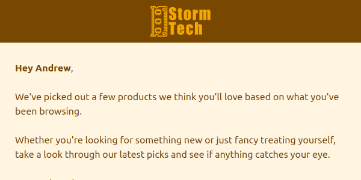
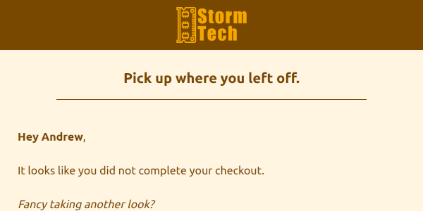
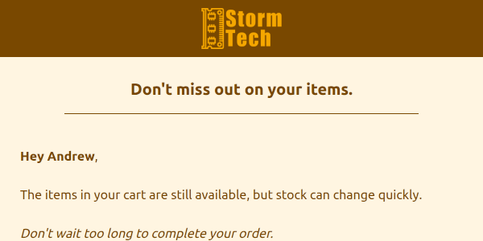

# Marketing and Transactional Email Templates

Built a realistic email marketing and transactional system for a fictional PC hardware ecommerce company.

## Technologies

- MJML
- Handlebars
- HTML Email
- Node.js
- Git

## Workflow

MJML templates are compiled into HTML and personalised using Handlebars before delivery.

(MJML → HTML → Handlebars Personalisation → Email Delivery)

## Features

- Responsive layouts
- Handlebars personalization
- Transactional and marketing emails
- Gmail desktop tested
- Gmail Android tested
- Dark mode optimised
- Accessible alt text

## Testing
> Templates were tested using real email clients (Gmail in Chrome and Gmail Android App) rather than commercial rendering services.

Each template was tested for:

- Gmail Desktop (Chrome)
- Gmail Android App
- Responsive behaviour
- Dark mode compatibility
- Accessibility considerations
- Descriptive image alt text

## Welcome Journey

### welcome-email-01

_Click preview to view full desktop render_

<a href="https://raw.githubusercontent.com/AndrewAttemptsCode/email-templates/refs/heads/main/src/assets/images/screenshots/ecommerce/welcome/welcome-email-01_desktop.png">🖥️ Desktop full screenshot</a> 
<a href="https://raw.githubusercontent.com/AndrewAttemptsCode/email-templates/refs/heads/main/src/assets/images/screenshots/ecommerce/welcome/welcome-email-01_mobile.png">📱 Mobile full screenshot</a> 
<a href="https://github.com/AndrewAttemptsCode/email-templates/blob/main/src/ecommerce/journeys/welcome/welcome-email-01.mjml">📄 MJML Source</a> 
<a href="https://github.com/AndrewAttemptsCode/email-templates/blob/main/dist/ecommerce/compiled/welcome/welcome-email-01.html">🌐 HTML Compiled Output</a> 
<a href="https://github.com/AndrewAttemptsCode/email-templates/blob/main/dist/ecommerce/personalised/welcome/handlebars-welcome-email-01.html">🌐 HTML Personalised Output</a>

### welcome-email-02

_Click preview to view full desktop render_

<a href="https://raw.githubusercontent.com/AndrewAttemptsCode/email-templates/refs/heads/main/src/assets/images/screenshots/ecommerce/welcome/welcome-email-02_desktop.png">🖥️ Desktop full screenshot</a> 
<a href="https://raw.githubusercontent.com/AndrewAttemptsCode/email-templates/refs/heads/main/src/assets/images/screenshots/ecommerce/welcome/welcome-email-02_mobile.png">📱 Mobile full screenshot</a> 
<a href="https://github.com/AndrewAttemptsCode/email-templates/blob/main/src/ecommerce/journeys/welcome/welcome-email-02.mjml">📄 MJML Source</a> 
<a href="https://github.com/AndrewAttemptsCode/email-templates/blob/main/dist/ecommerce/compiled/welcome/welcome-email-02.html">🌐 HTML Compiled Output</a> 
<a href="https://github.com/AndrewAttemptsCode/email-templates/blob/main/dist/ecommerce/personalised/welcome/handlebars-welcome-email-02.html">🌐 HTML Personalised Output</a>

### welcome-email-03

_Click preview to view full desktop render_

<a href="https://raw.githubusercontent.com/AndrewAttemptsCode/email-templates/refs/heads/main/src/assets/images/screenshots/ecommerce/welcome/welcome-email-03_desktop.png">🖥️ Desktop full screenshot</a> 
<a href="https://raw.githubusercontent.com/AndrewAttemptsCode/email-templates/refs/heads/main/src/assets/images/screenshots/ecommerce/welcome/welcome-email-03_mobile.png">📱 Mobile full screenshot</a> 
<a href="https://github.com/AndrewAttemptsCode/email-templates/blob/main/src/ecommerce/journeys/welcome/welcome-email-03.mjml">📄 MJML Source</a> 
<a href="https://github.com/AndrewAttemptsCode/email-templates/blob/main/dist/ecommerce/compiled/welcome/welcome-email-03.html">🌐 HTML Compiled Output</a> 
<a href="https://github.com/AndrewAttemptsCode/email-templates/blob/main/dist/ecommerce/personalised/welcome/handlebars-welcome-email-03.html">🌐 HTML Personalised Output</a>

## Abandoned Cart Journey

### cart-email-01

_Click preview to view full desktop render_

<a href="https://raw.githubusercontent.com/AndrewAttemptsCode/email-templates/refs/heads/main/src/assets/images/screenshots/ecommerce/abandoned-cart/cart-email-01_desktop.png">🖥️ Desktop full screenshot</a> 
<a href="https://raw.githubusercontent.com/AndrewAttemptsCode/email-templates/refs/heads/main/src/assets/images/screenshots/ecommerce/abandoned-cart/cart-email-01_mobile.png">📱 Mobile full screenshot</a> 
<a href="https://github.com/AndrewAttemptsCode/email-templates/blob/main/src/ecommerce/journeys/abandoned-cart/cart-email-01.mjml">📄 MJML Source</a> 
<a href="https://github.com/AndrewAttemptsCode/email-templates/blob/main/dist/ecommerce/compiled/abandoned-cart/cart-email-01.html">🌐 HTML Compiled Output</a> 
<a href="https://github.com/AndrewAttemptsCode/email-templates/blob/main/dist/ecommerce/personalised/abandoned-cart/handlebars-cart-email-01.html">🌐 HTML Personalised Output</a>

### cart-email-02

_Click preview to view full desktop render_

<a href="https://raw.githubusercontent.com/AndrewAttemptsCode/email-templates/refs/heads/main/src/assets/images/screenshots/ecommerce/abandoned-cart/cart-email-02_desktop.png">🖥️ Desktop full screenshot</a> 
<a href="https://raw.githubusercontent.com/AndrewAttemptsCode/email-templates/refs/heads/main/src/assets/images/screenshots/ecommerce/abandoned-cart/cart-email-02_mobile.png">📱 Mobile full screenshot</a> 
<a href="https://github.com/AndrewAttemptsCode/email-templates/blob/main/src/ecommerce/journeys/abandoned-cart/cart-email-02.mjml">📄 MJML Source</a> 
<a href="https://github.com/AndrewAttemptsCode/email-templates/blob/main/dist/ecommerce/compiled/abandoned-cart/cart-email-02.html">🌐 HTML Compiled Output</a> 
<a href="https://github.com/AndrewAttemptsCode/email-templates/blob/main/dist/ecommerce/personalised/abandoned-cart/handlebars-cart-email-02.html">🌐 HTML Personalised Output</a>

